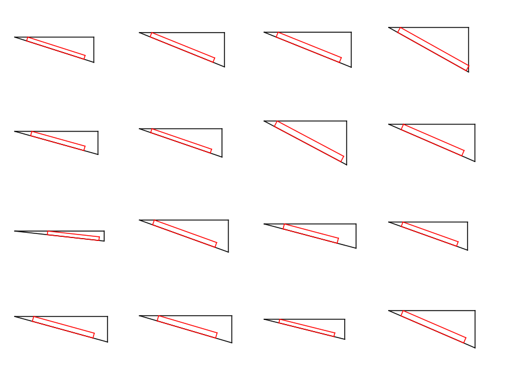

# tiny-dc3

This repository contains a generic implementation of the DC3 algorithm for learning optimization with hard constraints, as described in the paper [DC3: A learning method for optimization with hard constraints](https://arxiv.org/abs/2104.12225). The implementation uses Tinygrad, a fast, easy-to-understand, and lightweight deep learning library written in Python.

## Features

- **Mathematical Modeling Interface**: Define your problem's objective function and constraints using the ```Variable``` interface.
- **Easy Integration**: Built on tinygrad, tiny-dc3 is optimized for speed, maintaining a small footprint while ensuring code readability.

It's easy to use!

```python
from tiny_dc3 import Variable
var = Variable(200)
A = var[:100].reshape((10,10))
B = var[100:].reshape((10,10))
eq = [(A@B).sum(axis=1).max() - (A*B).abs().mean()]
```

## Quick Example - Aerospace Design

[Examples](https://github.com/franciscogaluppo/tiny-dc3/blob/main/examples/)

The aerospace design problem involves shaping a wedge (a triangle) in a high-speed airflow to optimize its performance. The goal is to minimize the drag-to-lift ratio, which affects the efficiency of the design, while considering certain geometric constraints.

The ratio of drag-to-lift can be expressed as:

$$\frac{D}{L}=\frac{c_d}{c_l},$$

Here, $c_d$ and $c_l$ correspond to the drag and lift coefficients, respectively. These coefficients are derived by integrating the projection of the pressure coefficient along the directions parallel and perpendicular to the body.


Assuming that the pressure coefficient is given by the Newtonian sine-squared law for whetted areas of the body, and that the free stream direction is parallel to the body, we have that

$$c_d=\frac{\Delta y}{s}$$
$$c_l=\frac{\Delta x}{s},$$

where $\Delta x$ and $\Delta y$ are the length of the catetes. Thus the ratio is simply

$$\frac{D}{L}=\frac{\Delta y}{\Delta x}$$

Let's now implement it using tiny-dc3.

```python
import tinygrad.nn.optim as optim
from tinygrad.tensor import Tensor
from tiny_dc3 import Variable, dc3, soft_loss
```

We will define one variable to each side of the triangle.

```python
length = 3
var = Variable(length)
x = var[0,None]
y = var[1,None]
s = var[2,None]
```

Then we need our constants. We will add constraints for maximum perimeter, maximum area and minimum lengths, but most importantly for the dimensions of our rectangles. We will sample many different rectangles to work as our training data, and store them as the input for the network.

```python
per_max = 2.5
area_max = 1
x_min = 0.1
y_min = 0.1

samples = 1000
a = Tensor.rand(samples,1)*0.02 + 0.04 # height
b = Tensor.rand(samples,1)*0.1  + 0.6  # width 
data = Tensor.cat(a, b, dim=1)
data = (data - [[.05,.65]]) / Tensor([[.02,.1]]) # Standardization
```

The image below helps us visualize what is the constraint that ensures the rectangles fit:

So our constraints are:

```python
eq = [x**2 + y**2 - s**2]
ineq = [
    x*a/y + y*a/x - s + b, # Rectangle fits
    x+y+s-per_max,         # Maximum perimeter
    x*y/2-area_max,        # Maximum area
    x_min-x,               # Minimum x
    y_min-y,               # Minimum y
    max(x_min,y_min)-s     # Minimum s
]
obj = y/x
```

Then it works as a regular step in our training!

```python
model = dc3(length, eq, ineq)
net = # ... Network 
opt = # ... Optimizer
lossf = soft_loss(obj, eq, ineq)

for i in range(10):
    x = net.forward(data)
    y = model.forward(x)
    opt.zero_grad()
    loss = lossf(y)
    loss.backward()
    opt.step()
```



This problem was adapted from [CVXPY](https://www.cvxpy.org/examples/dqcp/hypersonic_shape_design.html).

## Hyper-parameters

|Name|Default|Description|
|:---:|:---:|:---|
|```length```|-|Size of the solution.|
|```eq_resid```|-|List of expressions for the residuals of the equality constraints.|
|```ineq_resid```|-|List of expressions for the residuals of the inequality constraints.|
|```newton_tol```|1e-5|Tolerance for the Newton Algorithm.|
|```newton_iters```|50|Number of iterations for the Newton Algorithm|
|```corr_iters```|5|Number of iterations for the correction step.|
|```corr_lr```|1e-3|Learning rate $\gamma$ for the correction step.|
|```corr_momentum```|0.9|Momentum parameter or the correction step.|
|```corr_clip_grad_norm```|None|Maximum norm size of the correction step.|
|```int_mask```|None|(Experimental) Boolean array to indicate which variables are integer.|
|```int_step```|1e-1|(Experimental) Size of the step in the direction of the nearest integer.|

## Details

- When using bachted constants, it is important to ensure during the modelling that they have the same dimension as the bacthed inputs. If the user needs to use mini-batches, then the strategy would be to create a dc3 layer for each mini-batch.

- When doing a binary operation between a variable and a Tensor, like *, +, -, and /, the variable should be the at the left: ```variable * Tensor```.

- Operations that change the shape of the variable, like reshape, max, min, sum and mean, are batchless. For example, var.min(axis=0) will take the min along the first data dimension, not the batch dimension.

## Future Features
This work is in its very early stages. So expect some bugs and misbehaviors. There are still things that I want to add:

1. How to deal with singular matrices during the Newton Method;
1. GPU matrix inversion (it uses numpy right now);
1. Performance improvements;
1. Integer variables;
1. Tests;
1. Documentation.

## References

- Donti, P. L., Rolnick, D., & Kolter, J. Z. (2021). DC3: A learning method for optimization with hard constraints. arXiv preprint arXiv:2104.12225.